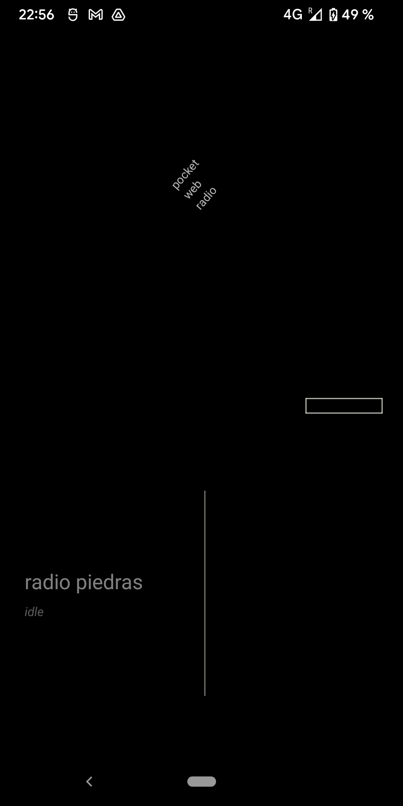
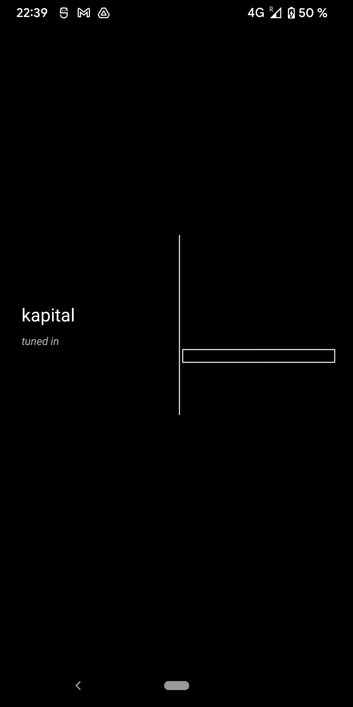

# pocketwebradio

a mobile application which aggregates the webradios I bookmarked throughout the years.

- all radio stations are pulled by an online version of `stations.json`
- scrolling is bottom-up
- each time a station starts to play, it queues all other stations randomly—so that you can press the next button and not know what's coming next.

## install

the app is based on `react-native@0.69.5` and `react-native-track-player@^3.1.0`. it builds on android, but i haven't tried on ios.

you can also download it from the [play store](https://play.google.com/store/apps/details?id=com.pocketwebradio).

## screenshots

 

## todo

### present

- [ ] animate sounds and opacity change
- [ ] hide radio name until tuned in
- [ ] handle unresponsive stations

### past

- [x] disconnect when you move away from station
- [x] get state of track player to see if it's buffering: if yes, don't load (not sure, how to deal with pending loads?)
- [x] add radio icon
- [x] add randomizing of stations
- [x] scroll interface
- [x] make tune font smaller/centered
- [x] make sure only one audio stream is ever used
- [x] load all stations from remote resource
- [x] setup react native dev environment
- [x] get the audio to work
- [x] implement global tuning state
    - [x] fix the display of each station (e.g should switch back to idle when another one is played)
- [x] animation on tuning button
    - [x] how to get the button to expand on radio playback?
- [x] fill content of json
- [x] implement double-play button on bluetooth speaker as 'nextStation'
- [x] make sure you never connect if the tuner is not set
- [x] make tune input area larger
- [x] invert scroll direction
- [x] tune in when you toggle tuner on station
